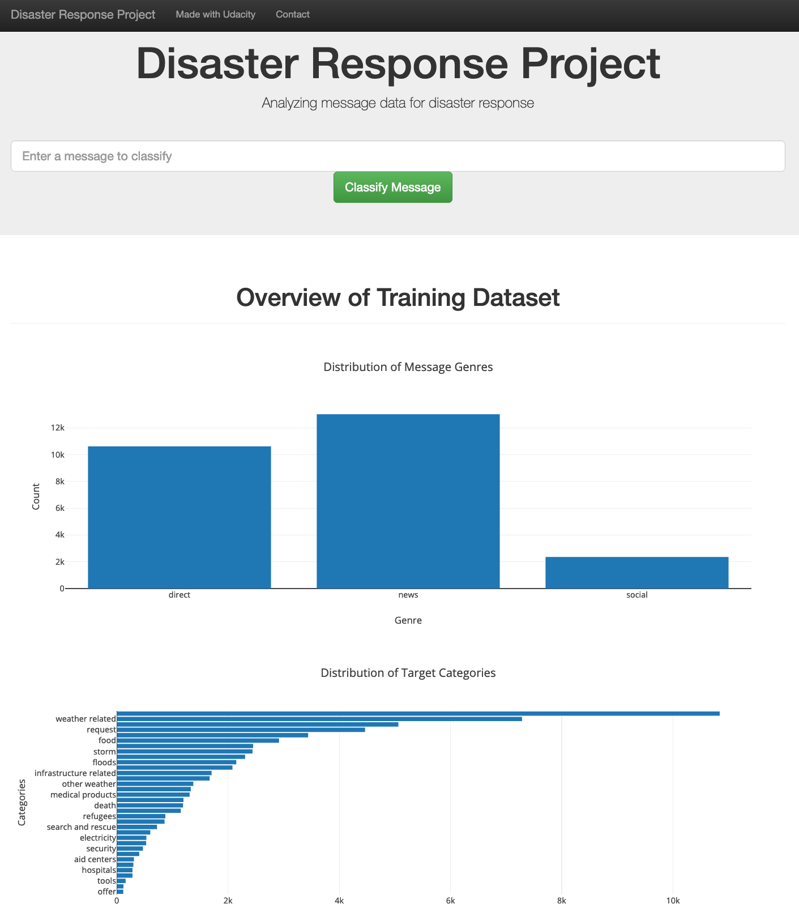
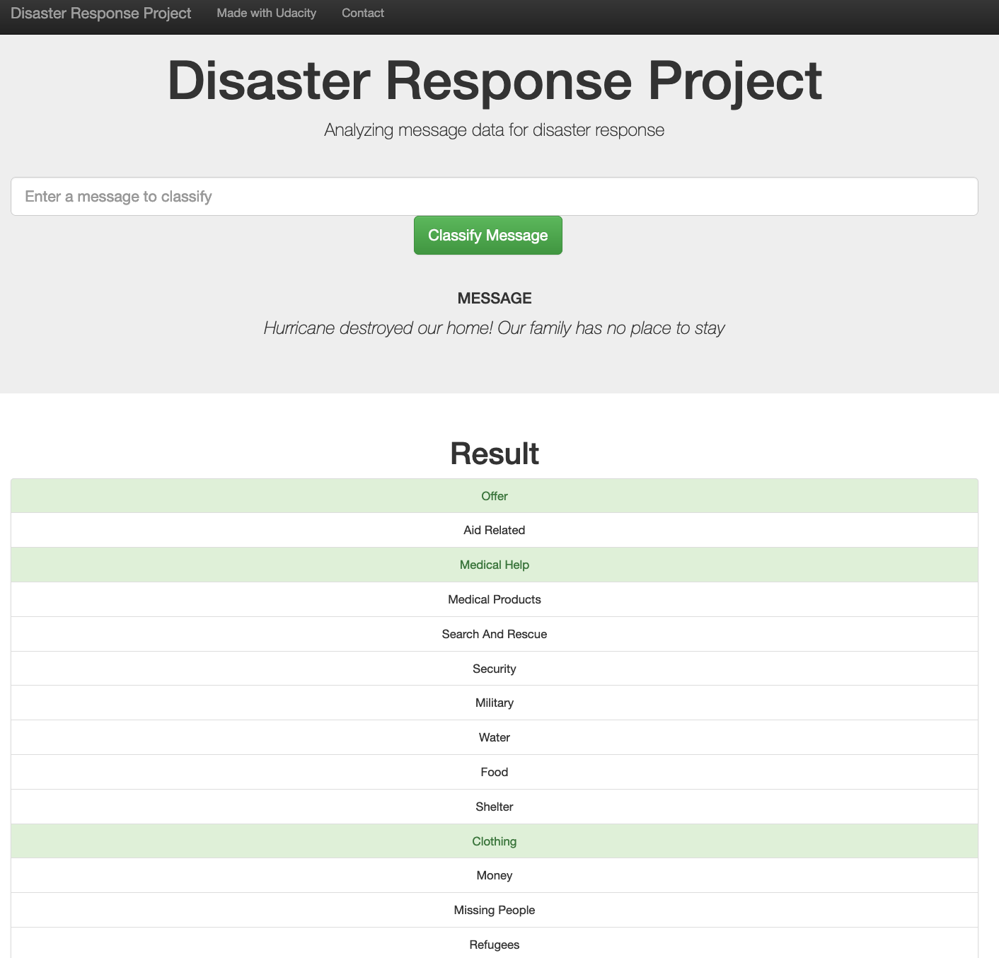

# Disaster Response Pipeline Project

The goal of this project was to create a data pipeline that consists of the following steps:

1. The ETL script takes the two datasets, cleans them, and stores the clean data into a SQLite database.
2. The machine learning script reads data from the database, creates and trains a classifier, and stores the classifier into a pickle file.
3. The web app renders in the browser. The main page includes some visualizations of data from the SQLite database. When a user inputs a message into the app, the app returns classification resultss.

## Data

In this project, I analyzed disaster data from Figure Eight (now [appen](https://appen.com/)) to build a model for an API that classifies disaster messages. The data set contains real messages that were sent during disaster events. All messages are categorized so we can apply a supervised machine learning model.

## Pipeline

### ETL part

The data cleaning pipeline that loads the messages and categories datasets and merges the two datasets into one. Next, it cleans the data - removes records that contain wrong values or are duplicates. Finally, it stores the cleaned data in a SQLite database. 

### Machine learning part

The machine learning pipeline that loads data from the SQLite database and then splits the dataset into training and test sets. Next, it builds a text processing and machine learning pipeline. The former cleans the messaages' text and creates lemmatized tokens for each message and outputs a matrix of token counts with tf–idf term weighting applied. The latter takes that output and trains and tunes a Ridge classifier model using GridSearchCV; then, it outputs summaries on the test set for each of the target categories and exports the final model as a pickle file.

## Results

The overall score of the model has the following value: 0.14505579068872643.

Below, you can see the results for each of the target categories. `1` and `0` are the values that indicate that a given message was assigned to a given cateogry, or not. 

```
=====request=====
              precision    recall  f1-score   support

           0       0.94      0.64      0.76      4318
           1       0.32      0.81      0.45       880

    accuracy                           0.67      5198
   macro avg       0.63      0.73      0.61      5198
weighted avg       0.84      0.67      0.71      5198

=====offer=====
              precision    recall  f1-score   support

           0       1.00      0.56      0.72      5172
           1       0.01      0.65      0.01        26

    accuracy                           0.56      5198
   macro avg       0.50      0.61      0.37      5198
weighted avg       0.99      0.56      0.71      5198

=====aid_related=====
              precision    recall  f1-score   support

           0       0.80      0.72      0.76      3026
           1       0.66      0.75      0.70      2172

    accuracy                           0.73      5198
   macro avg       0.73      0.74      0.73      5198
weighted avg       0.74      0.73      0.74      5198

=====medical_help=====
              precision    recall  f1-score   support

           0       0.95      0.57      0.71      4761
           1       0.12      0.67      0.21       437

    accuracy                           0.58      5198
   macro avg       0.54      0.62      0.46      5198
weighted avg       0.88      0.58      0.67      5198

=====medical_products=====
              precision    recall  f1-score   support

           0       0.97      0.55      0.71      4926
           1       0.08      0.68      0.14       272

    accuracy                           0.56      5198
   macro avg       0.52      0.62      0.42      5198
weighted avg       0.92      0.56      0.68      5198

=====search_and_rescue=====
              precision    recall  f1-score   support

           0       0.98      0.56      0.71      5063
           1       0.03      0.53      0.06       135

    accuracy                           0.56      5198
   macro avg       0.50      0.55      0.39      5198
weighted avg       0.95      0.56      0.70      5198

=====security=====
              precision    recall  f1-score   support

           0       0.99      0.56      0.71      5107
           1       0.02      0.57      0.04        91

    accuracy                           0.56      5198
   macro avg       0.50      0.56      0.38      5198
weighted avg       0.97      0.56      0.70      5198

=====military=====
              precision    recall  f1-score   support

           0       0.97      0.55      0.70      5017
           1       0.04      0.56      0.08       181

    accuracy                           0.55      5198
   macro avg       0.51      0.56      0.39      5198
weighted avg       0.94      0.55      0.68      5198

=====water=====
              precision    recall  f1-score   support

           0       0.98      0.58      0.73      4875
           1       0.12      0.85      0.21       323

    accuracy                           0.59      5198
   macro avg       0.55      0.71      0.47      5198
weighted avg       0.93      0.59      0.69      5198

=====food=====
              precision    recall  f1-score   support

           0       0.98      0.61      0.75      4612
           1       0.23      0.89      0.36       586

    accuracy                           0.65      5198
   macro avg       0.60      0.75      0.56      5198
weighted avg       0.89      0.65      0.71      5198

=====shelter=====
              precision    recall  f1-score   support

           0       0.97      0.59      0.73      4733
           1       0.16      0.81      0.27       465

    accuracy                           0.61      5198
   macro avg       0.57      0.70      0.50      5198
weighted avg       0.90      0.61      0.69      5198

=====clothing=====
              precision    recall  f1-score   support

           0       0.99      0.56      0.71      5112
           1       0.02      0.66      0.05        86

    accuracy                           0.56      5198
   macro avg       0.51      0.61      0.38      5198
weighted avg       0.97      0.56      0.70      5198

=====money=====
              precision    recall  f1-score   support

           0       0.98      0.56      0.71      5071
           1       0.04      0.65      0.07       127

    accuracy                           0.56      5198
   macro avg       0.51      0.60      0.39      5198
weighted avg       0.96      0.56      0.70      5198

=====missing_people=====
              precision    recall  f1-score   support

           0       0.99      0.56      0.71      5138
           1       0.01      0.35      0.02        60

    accuracy                           0.55      5198
   macro avg       0.50      0.45      0.36      5198
weighted avg       0.98      0.55      0.70      5198

=====refugees=====
              precision    recall  f1-score   support

           0       0.98      0.56      0.71      5011
           1       0.05      0.63      0.09       187

    accuracy                           0.56      5198
   macro avg       0.51      0.59      0.40      5198
weighted avg       0.94      0.56      0.69      5198

=====death=====
              precision    recall  f1-score   support

           0       0.97      0.56      0.71      4955
           1       0.07      0.66      0.12       243

    accuracy                           0.57      5198
   macro avg       0.52      0.61      0.42      5198
weighted avg       0.93      0.57      0.68      5198

=====other_aid=====
              precision    recall  f1-score   support

           0       0.93      0.58      0.71      4545
           1       0.19      0.69      0.30       653

    accuracy                           0.59      5198
   macro avg       0.56      0.63      0.51      5198
weighted avg       0.84      0.59      0.66      5198

=====infrastructure_related=====
              precision    recall  f1-score   support

           0       0.96      0.56      0.71      4873
           1       0.09      0.64      0.15       325

    accuracy                           0.56      5198
   macro avg       0.52      0.60      0.43      5198
weighted avg       0.90      0.56      0.67      5198

=====transport=====
              precision    recall  f1-score   support

           0       0.97      0.56      0.71      4976
           1       0.06      0.64      0.11       222

    accuracy                           0.56      5198
   macro avg       0.52      0.60      0.41      5198
weighted avg       0.93      0.56      0.68      5198

=====buildings=====
              precision    recall  f1-score   support

           0       0.97      0.57      0.72      4913
           1       0.09      0.73      0.16       285

    accuracy                           0.58      5198
   macro avg       0.53      0.65      0.44      5198
weighted avg       0.92      0.58      0.69      5198

=====electricity=====
              precision    recall  f1-score   support

           0       0.98      0.55      0.71      5083
           1       0.03      0.52      0.05       115

    accuracy                           0.55      5198
   macro avg       0.50      0.54      0.38      5198
weighted avg       0.96      0.55      0.69      5198

=====tools=====
              precision    recall  f1-score   support

           0       1.00      0.56      0.72      5169
           1       0.01      0.72      0.02        29

    accuracy                           0.56      5198
   macro avg       0.50      0.64      0.37      5198
weighted avg       0.99      0.56      0.71      5198

=====hospitals=====
              precision    recall  f1-score   support

           0       0.99      0.56      0.71      5149
           1       0.01      0.59      0.02        49

    accuracy                           0.56      5198
   macro avg       0.50      0.57      0.37      5198
weighted avg       0.98      0.56      0.71      5198

=====shops=====
              precision    recall  f1-score   support

           0       1.00      0.56      0.71      5176
           1       0.01      0.64      0.01        22

    accuracy                           0.56      5198
   macro avg       0.50      0.60      0.36      5198
weighted avg       0.99      0.56      0.71      5198

=====aid_centers=====
              precision    recall  f1-score   support

           0       0.99      0.55      0.71      5142
           1       0.01      0.61      0.03        56

    accuracy                           0.55      5198
   macro avg       0.50      0.58      0.37      5198
weighted avg       0.98      0.55      0.70      5198

=====other_infrastructure=====
              precision    recall  f1-score   support

           0       0.97      0.56      0.71      4972
           1       0.06      0.60      0.11       226

    accuracy                           0.56      5198
   macro avg       0.51      0.58      0.41      5198
weighted avg       0.93      0.56      0.68      5198

=====weather_related=====
              precision    recall  f1-score   support

           0       0.92      0.75      0.82      3753
           1       0.56      0.83      0.67      1445

    accuracy                           0.77      5198
   macro avg       0.74      0.79      0.75      5198
weighted avg       0.82      0.77      0.78      5198

=====floods=====
              precision    recall  f1-score   support

           0       0.96      0.57      0.71      4775
           1       0.13      0.70      0.21       423

    accuracy                           0.58      5198
   macro avg       0.54      0.64      0.46      5198
weighted avg       0.89      0.58      0.67      5198

=====storm=====
              precision    recall  f1-score   support

           0       0.96      0.59      0.73      4709
           1       0.16      0.76      0.26       489

    accuracy                           0.60      5198
   macro avg       0.56      0.67      0.50      5198
weighted avg       0.88      0.60      0.68      5198

=====fire=====
              precision    recall  f1-score   support

           0       0.99      0.56      0.71      5144
           1       0.01      0.41      0.02        54

    accuracy                           0.55      5198
   macro avg       0.50      0.48      0.36      5198
weighted avg       0.98      0.55      0.70      5198

=====earthquake=====
              precision    recall  f1-score   support

           0       0.98      0.60      0.74      4737
           1       0.18      0.88      0.29       461

    accuracy                           0.63      5198
   macro avg       0.58      0.74      0.52      5198
weighted avg       0.91      0.63      0.70      5198

=====cold=====
              precision    recall  f1-score   support

           0       0.98      0.55      0.71      5085
           1       0.02      0.48      0.04       113

    accuracy                           0.55      5198
   macro avg       0.50      0.52      0.38      5198
weighted avg       0.96      0.55      0.69      5198

=====other_weather=====
              precision    recall  f1-score   support

           0       0.96      0.56      0.70      4918
           1       0.07      0.59      0.13       280

    accuracy                           0.56      5198
   macro avg       0.52      0.57      0.41      5198
weighted avg       0.91      0.56      0.67      5198

=====direct_report=====
              precision    recall  f1-score   support

           0       0.91      0.63      0.75      4172
           1       0.34      0.76      0.47      1026

    accuracy                           0.66      5198
   macro avg       0.63      0.70      0.61      5198
weighted avg       0.80      0.66      0.69      5198
```

When we look at the results we see that the more imbalanced a given category is, the worse the results. The whole set is highly imbalanced and some categories have only a few examples to train the model on. This makes it hard to achieve better accuracy.

## Web app

The web app displays some visualizations of the data. 

It also contains a text field where you can input a new message and get classification results in several categories.






## How to run it

### Installation

Libraries and their versions required for replication of this analysis are listed in the `requirements.txt` file.

Run `conda create --name <env> --file requirements.txt` to create a conda environment, and then `conda activate <env>` to activate it.

Python version: 3.8.11

### Instructions:
1. Run the following commands in the project's root directory to set up your database and model.

    - To run ETL pipeline that cleans data and stores in database
        `python data/process_data.py data/disaster_messages.csv data/disaster_categories.csv data/DisasterResponse.db`
    - To run ML pipeline that trains classifier and saves
        `python models/train_classifier.py data/DisasterResponse.db models/classifier.pkl`

2. Run the following command in the app's directory to run your web app.
    `python app/run.py data/DisasterResponse.db models/classifier.pkl`

3. Go to http://0.0.0.0:3001/
